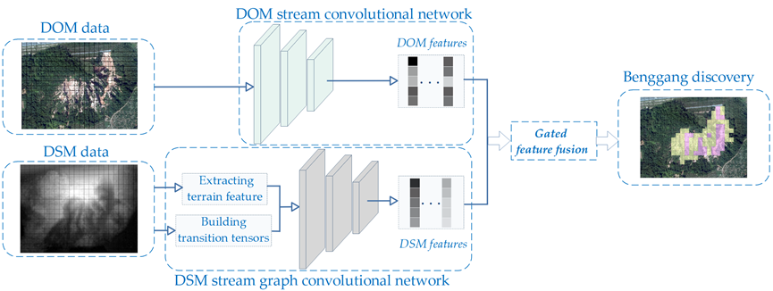

# Deep fusion of DOM and DSM features for Benggang Discovery
## Introduction

This repository contains the code to our paper "Deep fusion of DOM and DSM 
features for Benggang Discovery". 
Benggang is a Chinese word for a typical gully erosional landform. 
In this paper, we propose to integrate high resolution Digital Orthophoto Map (DOM) and DSM 
data for efficient and automatic Benggang detection with an integrated 
end-to-end learning model.

<p align="center"></p>

## Dependencies

- python==3.8.3
- pytorch==1.6.0
- torchvision==0.7.0
- numpy==1.18.5
- scikit-learn==0.23.1

## Folder Structure

```
  ├── train.py                # train and test the proposed model
  ├── dcnn.py                # Code for diffusion convolution
  ├── FusionNet.py          # Network structure of proposed fusion model
  ├── MyDataset.py         # Customized dataloader
  ├── DSM_Extract.py        # Code for feature extraction of DSM
  ├── scatterplot.py          # Code for scatter chart analysis
  └── Readme                # This document
label
  ├── label1                # label of Dataset1
  └── label1_2            # label of Dataset1 and Dataset2
```

## Data

The DOM and DSM data used in the experimetns cannot be shared at this time due to our agreement with the data provider.

## Train and Test 
Change the train and test data directories. Train the model and then report performance:

```
python train.py
```

## References
[1] Atwood, J.; Towsley, D. Diffusion-convolutional neural networks. In 30th Conference on Neural Information Processing Sys-tems (NIPS 2016), Barcelona, Spain, December 5-10, 2016.
[[Code]](https://github.com/jcatw/dcnn)

[2] Simonyan, K.; Zisserman, A. 2015. Very deep convolutional networks for large-scale image recognition. In 3rd International Conference on Learning Representations (ICLR), San Diego, CA, USA, May 7-9, 2015.
[[Code]](https://github.com/msyim/VGG16)

[3] Arevalo, J.; Solorio, T.; Montes-y-Gomez, M.; Gonzalez, F. Gated multimodal unit for information fusion. ICLR 2017, Toulon, France, April 24-26, 2017.
[[Code]](https://github.com/johnarevalo/gmu-mmimdb)
